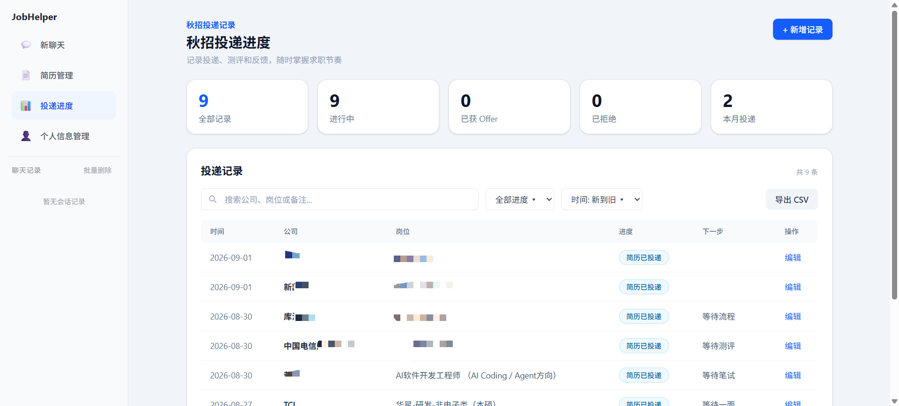

# 🎯 JobHelper — AI 求职投递助手

> 一个用**自然语言**驱动浏览器、帮你完成「搜岗位 → 填表单 → 投简历 → 管进度」全流程的 AI Agent，把秋招海投从几小时的重复劳动压缩成几句对话。

---

## ✨ 功能特性

### 1. 浏览器自动化投递 —— 一句话搞定简历投递
Agent 通过 Playwright MCP 以有头浏览器打开投递页，由确定性状态机（LangGraph）接管完整的投递链路：**等待登录 → 上传简历 → 快照分析表单 → 自动填基本信息 → 识别并填写下拉框**，期间只在与用户交互（登录、选择简历）或语义判断时停顿，不再依赖大模型临场编排，每一步都能看到浏览器实时操作。


### 2. 岗位知识库 + 混合检索 (RAG)
抓取过的职位信息会向量化入库（ChromaDB + Ollama bge-m3 稠密向量，jieba 分词 + BM25 稀疏检索，RRF 融合排序）。Agent 直接回答「XX 公司的 Java 岗要求是什么」「有哪些上海的算法岗」，不用你翻几十个网页。


### 3. 子 Agent 并行调度，批量抓取
主 Agent 分析出招聘网站上的公司列表后，通过 `dispatchTasks` 把成百上千条「点击 + 抓详情」任务池化派发给多个子 Agent 并发执行，客户端池自动限流，结果按结构化格式回传并去重入库。

### 4. 可视化求职工作台
- **简历管理**：块状可视化编辑器，自动生成排版统一的 LaTeX（ctexart）简历并编译导出；
- **投递进度**：统计卡片 + 可搜索/筛选/排序的进度表，一键导出 CSV，秋招节奏尽在掌握；
- **个人信息管理**：字段自定义 + 敏感字段自动脱敏，投递表单一键回填。



### 5. 双协议流式兼容
同时兼容 **Anthropic** 与 **OpenAI** 流式事件协议，通过可配置的 LLM 供应商层接入任意模型（支持扩展思考/thinking），前后端走 SSE 实时推送打字机效果、思考过程与工具调用状态。


---

## 🧰 技术栈

**后端**


**前端**


| 模块 | 技术 |
| --- | --- |
| 后端 API | Python · FastAPI · uvicorn |
| Agent 编排 | LangGraph（ReAct + 投递状态机） |
| LLM 接入 | `anthropic` / `openai` SDK 双协议，YAML 配置多供应商 |
| 浏览器自动化 | Playwright MCP 服务（独立进程，有头模式 + 持久化 profile） |
| 检索 | ChromaDB（稠密）+ jieba/rank_bm25（稀疏）→ RRF 融合 |
| 前端 | React 19 · TypeScript · Vite · Tailwind CSS 4 · React Flow |
| 简历导出 | LaTeX（ctexart）编译为 PDF |
| 数据持久化 | JSON 文件存储（会话 / 简历 / 个人信息 / 投递记录 / 向量库） |

> 详细依赖版本见 [`requirements.txt`](requirements.txt) 与 [`frontend/package.json`](frontend/package.json)。

---

## 🚀 快速开始

```bash
# 1. 准备依赖
pip install -r requirements.txt        # 后端（Python 3.12）
cd frontend && npm install && cd ..     # 前端

# 2. 配置 LLM 供应商（含流式协议、模型、API Key）
cp config.example.yaml config.yaml      # 并填入你的模型配置

# 3. 一键启动后端 + 前端 + Playwright MCP 浏览器
python run.py
```

访问 `http://localhost:5173`，点击 **新聊天**，对 Agent 说：

> 「打开 https://example.com/jobs 的投递页，帮我把简历投了」

Agent 会带你走完整个投递流程。

---

## 📌 项目结构

```
JobHelper/
├── src/
│   ├── api/            # FastAPI 路由、SSE、会话/简历/个人信息/投递记录存储
│   ├── chat/           # LangGraph 对话图 + 投递流程状态机
│   ├── browser_mcp/    # Playwright MCP 客户端（快照、填表、下拉框、上传）
│   ├── llm/            # LLM 客户端抽象（anthropic / openai 双协议工厂）
│   ├── rag/            # 职位向量库与混合检索（ChromaDB + BM25 + RRF）
│   ├── sub_agent/      # 子 Agent 调度器与 Worker
│   ├── tools/          # 工具系统（注册中心 + 内置工具）
│   ├── latex/          # 简历 LaTeX 生成与编译
│   └── prompt/         # 系统提示词
├── frontend/           # React 前端
├── docs/               # 各功能开发文档（spec / plan / task）
├── run.py              # 一键启动脚本
└── config.example.yaml # 配置模板
```

---

## 🖼️ 截图占位说明

以上 README 中的图片均为占位符，推荐按下表截图替换（文件名与 `docs/images/` 路径一一对应）：

| 占位文件 | 建议截图内容 | 操作步骤 |
| --- | --- | --- |
| `docs/images/apply-flow.gif` | **投递流程自动填写** | 在聊天页让 Agent 打开一个投递页，录屏展示「上传简历 → 自动填表 → 填下拉框 → 提交成功」全过程 |
| `docs/images/rag-chat.gif` | **岗位库检索问答** | 聊天页提问「有哪些后端开发的岗位」，展示 Agent 调 `searchJobs` 返回结构化职位结果 |
| `docs/images/chat.png` | **主对话界面**（新聊天/会话页） | 一个完整的流式对话页面，含打字机效果、工具调用状态 |
| `docs/images/dashboard.png` | **投递进度页** | 点击左侧「投递进度」：统计卡片（本月/进行中/Offer/已拒）+ 投递记录表 |
| `docs/images/resume.png` | **简历管理页** | 点击左侧「简历管理」：块状编辑器 + 生成后的 LaTeX/PDF 预览 |
| `docs/images/profile.png` | **个人信息管理页** | 点击左侧「个人信息管理」：基本信息、教育/获奖/语言条目、敏感字段脱敏开关 |

> GIF 推荐使用 [ScreenToGif](https://www.screentogif.com/) 或 macOS `QuickTime` + `gifski` 录制导出。

---

## 🧩 相关技能

本项目文档中沉淀了若干可复用的求职侧能力（简历酥化、面试追问、进度管理、开源贡献等），均以 Claude Code / ASU 技能形式维护。

---

## 📄 License

MIT